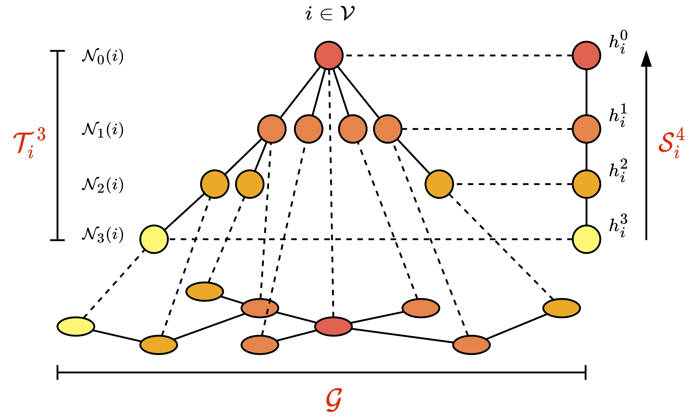

# S4G

The official implementation of the paper "Breaking the Bottleneck on Graphs with Structured State Spaces" (CIKM 2024).

<p align="middle">

</p>

## Dependencies
### `Conda` environment
On Linux, prepare the `conda` virtual environment as follows:
```zsh
conda create -n s4g python=3.9
conda activate s4g
conda install pytorch torchvision torchaudio pytorch-cuda=11.8 -c pytorch -c nvidia
conda install cuda-toolkit cuda-nvcc -c "nvidia/label/cuda-11.8.0"
conda install pyg -c pyg
pip install torch_scatter torch_sparse -f https://data.pyg.org/whl/torch-2.0.1+cu118.html
pip install -r requirements.txt
```

### SSM `CUDA kernel`

To utilize S4 models, the initial step is to compile the SSM `CUDA kernel` with following steps:
```zsh
cd layer/state_spaces/extensions/kernels
python setup.py install
```

## Define hyper-parameters

> **Note**: you need a wandb account and activate it on your local machine & server. ([Quickstart](https://docs.wandb.ai/quickstart))

**The best hyperparameters for each dataset can be found in the `best_params` folder.** Please fill in your wandb ID in the corresponding file's `entity` section.

Create a [`wandb sweep`](https://docs.wandb.ai/guides/sweeps) (replace `configs.yaml` with the yaml file your want to use in `best_params` folder):
```zsh
wandb sweep configs.yaml
```

You will get the info about the sweep you created, like:
```bash
wandb: Creating sweep from: configs.yaml
wandb: Created sweep with ID: yyy
wandb: View sweep at: https://wandb.ai/xxx/S4GNN/sweeps/yyy
wandb: Run sweep agent with: wandb agent xxx/S4GNN/yyy
```

## Run experiments
Run `wandb agent`:
```zsh
nohup sh -c "python log.py && CUDA_VISIBLE_DEVICES=0 wandb agent xxx/S4GNN/SWEEP" > "local/logs/$(date +"%Y-%m%d-%H-%M-%S").txt" 2>&1 &
```
Just replace the `SWEEP` to a specific sweep id, which is obtained from last step, like: `yyy`. This command will first log the current source code to wandb as [Artifact](https://docs.wandb.ai/guides/artifacts), and then start a [wandb agent](https://docs.wandb.ai/guides/sweeps/start-sweep-agents) to run experiment, all the output from the terminal will be logged in the background.

The logs with timestamp-specified name can be found in `local/logs/` folder, and the trainning curves and details about your experiments can be found in your `wandb` dashboard.

## Citation

If you found the provided code with our paper useful in your work, we kindly request that you cite our work. 

```BibTex
@inproceedings{song2024breaking,
    title={Breaking the Bottleneck on Graphs with Structured State Spaces},
    author={Yunchong Song and Siyuan Huang and Jiacheng Cai and Xinbing Wang and Chenghu Zhou and Zhouhan Lin},
    booktitle={33rd ACM International Conference on Information and Knowledge Management},
    year={2024}
}
```